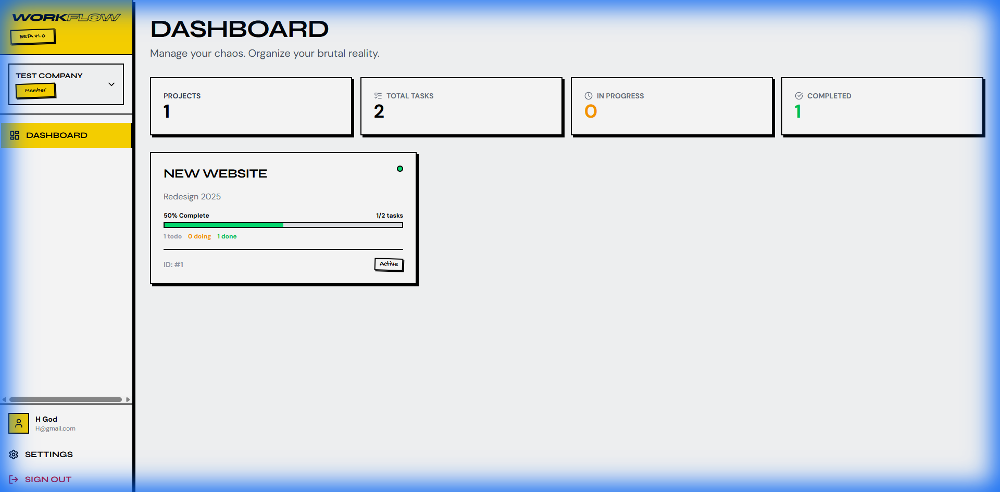
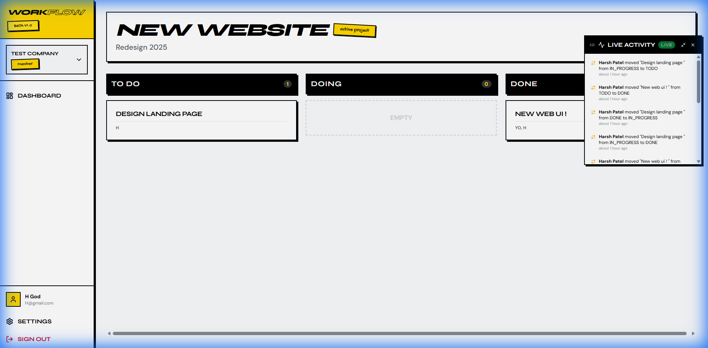
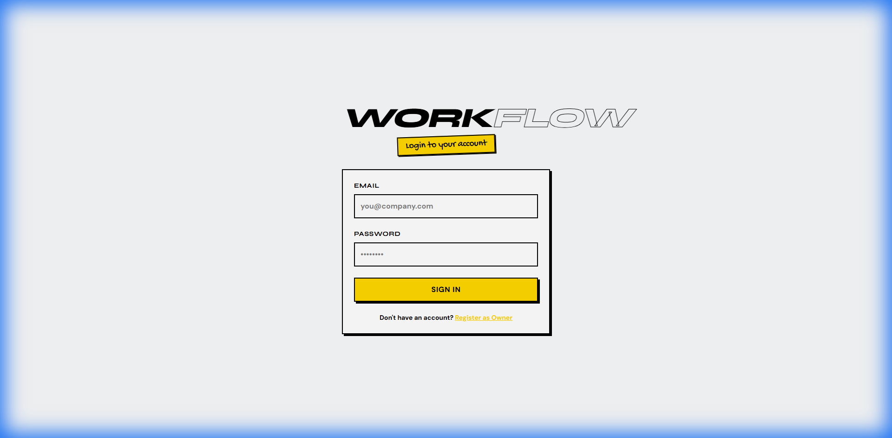

# VoiceApp Wrapper - Project Management System

A full-stack project management application with multi-tenant organization support, Kanban-style task boards, and role-based access control.

## 🚀 Features

- **Multi-tenant Organizations**: Create and manage multiple organizations with isolated data
- **Role-Based Access Control**: Owner and Member roles with different permissions
- **Project Management**: Create projects, track progress, and manage deadlines
- **Kanban Board**: Drag-and-drop task management with TODO, IN_PROGRESS, and DONE columns
- **Real-time Activity Feed**: Track all project activities
- **Team Collaboration**: Invite members, assign tasks, and add comments
- **GraphQL API**: Flexible and efficient API with authentication

## 🛠 Tech Stack

### Backend
- **Python 3.11+** with Django 4.x
- **Graphene-Django** for GraphQL API
- **Django GraphQL JWT** for authentication
- **SQLite** (development) / PostgreSQL (production)

### Frontend
- **React 18** with TypeScript
- **Vite** for fast development builds
- **Apollo Client** for GraphQL integration
- **React Router** for navigation

### Infrastructure
- **Docker** & Docker Compose for containerization
- **Nginx** for production frontend serving

## 📋 Prerequisites

- Python 3.11+
- Node.js 18+ (or Bun)
- Docker & Docker Compose (optional)

## 🔧 Installation

### Option 1: Local Development

#### Backend Setup

```bash
# Navigate to backend directory
cd apps/backend

# Create virtual environment
python -m venv venv

# Activate virtual environment
# Windows:
venv\Scripts\activate
# macOS/Linux:
source venv/bin/activate

# Install dependencies
pip install django graphene-django django-graphql-jwt django-cors-headers

# Run migrations
python manage.py migrate

# Create superuser (optional)
python manage.py createsuperuser

# Start development server
python manage.py runserver
```

The backend API will be available at `http://localhost:8000/graphql`

#### Frontend Setup

```bash
# Navigate to frontend directory
cd apps/frontend

# Install dependencies (using npm or bun)
npm install
# or
bun install

# Start development server
npm run dev
# or
bun dev
```

The frontend will be available at `http://localhost:5173`

### Option 2: Docker Compose

```bash
# Build and start all services
docker-compose up --build

# Or run in detached mode
docker-compose up -d --build
```

Services will be available at:
- Frontend: `http://localhost:3000`
- Backend API: `http://localhost:8000/graphql`

## 📁 Project Structure

```
├── apps/
│   ├── backend/               # Django backend
│   │   ├── api/               # Main GraphQL schema aggregation
│   │   ├── config/            # Django settings and URLs
│   │   ├── core/              # Authentication and user management
│   │   ├── organizations/     # Multi-tenant organization logic
│   │   └── projects/          # Projects, tasks, and activities
│   │
│   └── frontend/              # React frontend
│       └── src/
│           ├── components/    # Reusable UI components
│           ├── contexts/      # React context providers
│           ├── lib/           # Utilities and Apollo client
│           └── pages/         # Page components
│
├── docs/
│   └── screenshots/           # Application screenshots
│
├── docker-compose.yml         # Docker orchestration
├── API_DOCUMENTATION.md       # API reference
└── TECHNICAL_SUMMARY.md       # Architecture decisions
```

## 🔐 Authentication

The application uses JWT (JSON Web Tokens) for authentication:

1. **Register as Owner**: Creates user + organization + membership
2. **Login**: Returns JWT token for subsequent requests
3. **Invite Members**: Owners can invite others via email token
4. **Accept Invite**: Invited users create account and join organization

## 👥 Role Permissions

| Action | Owner | Member |
|--------|-------|--------|
| View organization | ✅ | ✅ |
| Create projects | ✅ | ❌ |
| Create tasks | ✅ | ❌ |
| Update tasks | ✅ | ❌ |
| Delete tasks | ✅ | ❌ |
| View assigned tasks | ✅ | ✅ |
| Add comments | ✅ | ✅ (on assigned tasks) |
| Invite members | ✅ | ❌ |

## 📸 Screenshots

### Dashboard


### Kanban Board


### Login


## 🧪 Testing

### Backend Tests
```bash
cd apps/backend
python manage.py test
```

### Frontend Tests
```bash
cd apps/frontend
npm run test
```

## 📄 Additional Documentation

- [API Documentation](API_DOCUMENTATION.md) - Complete GraphQL API reference
- [Technical Summary](TECHNICAL_SUMMARY.md) - Architecture decisions and trade-offs

## 📝 License

This project is part of an assignment submission.

---

Built with ❤️ using Django, GraphQL, and React
